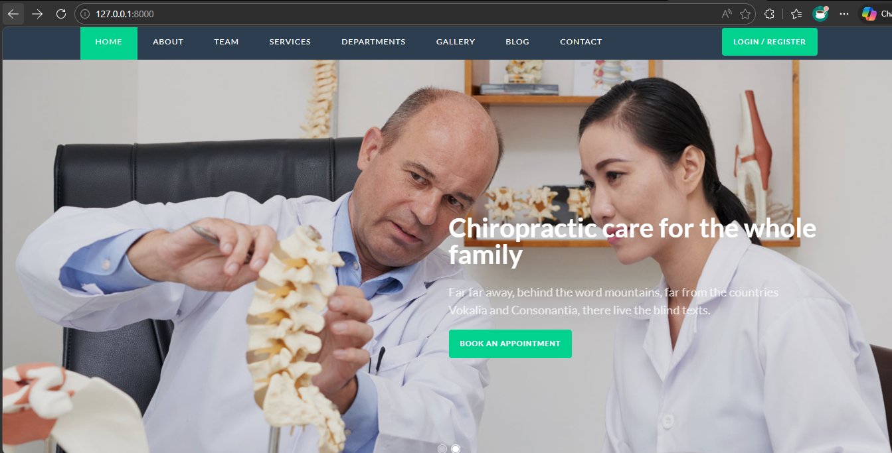
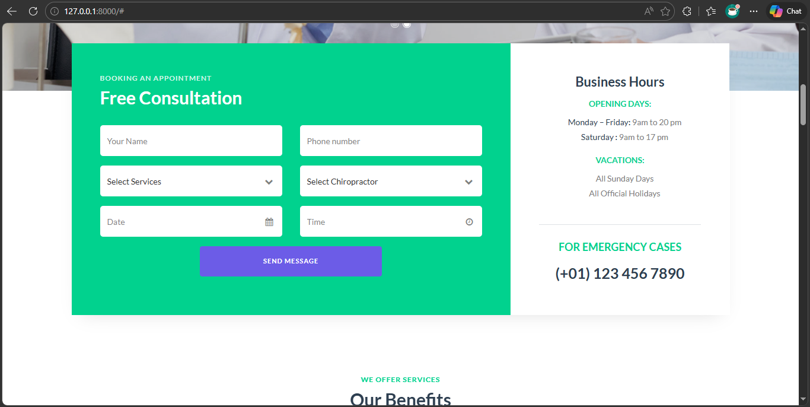
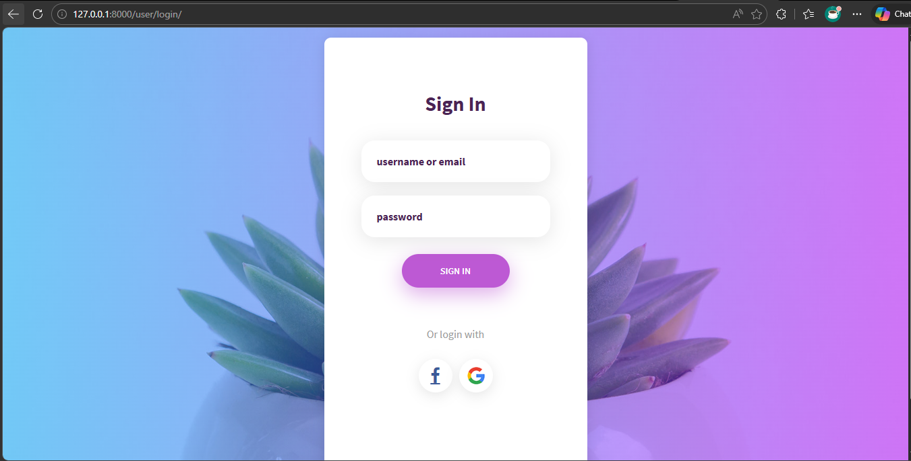

# Medical Services Portal 🩺

> ⚠️ **NOTICE: This project is currently under development.** Features, UI elements, and database schemas are actively being built and are subject to change.

## About the Project
This is a comprehensive web application for a medical services clinic, built using Django. It provides a seamless experience for patients to explore medical services, book appointments with doctors online, and manage their health records securely via a personal dashboard.

## Screenshots

Here is a look at the current progress of the application:

### 1. Home Page

*The landing page outlining available medical services, clinic hours, and general information.*

### 2. Booking an Appointment

*The scheduling interface where patients can select a doctor, choose a date, and secure a time slot.*

### 3. User Dashboard Login

*The secure login portal for patients and staff to access their personal dashboards and medical histories.*

---

## Getting Started

Follow these instructions to get a copy of the project up and running on your local machine for development and testing.

### Prerequisites

Ensure you have Python installed on your computer before beginning. 
* Download it here: [Install Python](https://www.python.org/downloads/)

### Installation & Setup

**1. Clone the repository and navigate into it:**
```bash
# Open your terminal in the project folder
cd medical_services_project

```

**2. Create a virtual environment:**
This keeps your project dependencies isolated from other Python projects on your computer.

```bash
python3 -m venv .venv

```

**3. Activate the virtual environment:**

* **On macOS/Linux:**
```bash
source .venv/bin/activate

```


* **On Windows:**
```bash
.venv\Scripts\activate

```


**4. Install Django:**
Install the core web framework. *(Note: If you add a `requirements.txt` file later, use `pip install -r requirements.txt` instead).*

```bash
pip install django

```

**5. Apply database migrations:**
Set up the initial SQLite database tables for the project.

```bash
python manage.py migrate

```

**6. Run the development server:**

```bash
python manage.py runserver

```

Once the server is running, open your web browser and go to `http://127.0.0.1:8000/` to view the site!

